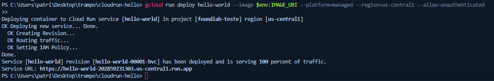
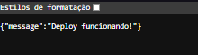

# 🚀 Deploy Hello World no Google Cloud Run (Padrão FoundLab)

Este projeto é um **MVP mínimo** com FastAPI, pronto para deploy no Google Cloud Run.

---

## 🔖 Requisitos

* Conta Google com acesso ao Google Cloud Platform
* Docker instalado ([Download Docker Desktop](https://www.docker.com/products/docker-desktop/))
* Google Cloud SDK ([Guia de instalação](https://cloud.google.com/sdk/docs/install))
* Projeto criado no GCP (budget travado para teste!)
* Permissões mínimas: Editor, Cloud Run Admin, Artifact Registry Admin

---

## 📂 Estrutura do Projeto

```
cloudrun-hello/
├── app.py
├── Dockerfile
├── requirements.txt
└── shutdown.sh
```

---

## 1️⃣ Clonar ou baixar o repositório

Se estiver no GitHub:

```sh
git clone https://github.com/seuuser/cloudrun-hello.git
cd cloudrun-hello
```

Ou baixe e extraia o .zip nesta pasta.

---

## 2️⃣ Testar localmente (opcional, mas recomendado)

```sh
python -m venv venv
# Ative o venv (Windows)
venv\Scripts\activate
# Instale dependências
pip install -r requirements.txt
# Rode o app
uvicorn app:app --reload --port 8080
```

Abra [http://localhost:8080](http://localhost:8080)
Resposta esperada: `{"message":"Deploy funcionando!"}`

---

## 3️⃣ Login no Google Cloud e configuração

```sh
gcloud init
gcloud auth login
gcloud config set project SEU_PROJECT_ID
```

*Substitua `SEU_PROJECT_ID` pelo id do seu projeto.*

---

## 4️⃣ Criar repositório Docker no Artifact Registry (uma vez por projeto)

```sh
gcloud artifacts repositories create hello-repo \
  --repository-format=docker \
  --location=us-central1
```

*Se já criou antes, pode pular.*

---

## 5️⃣ Configurar Docker para autenticar no Artifact Registry

```sh
gcloud auth configure-docker us-central1-docker.pkg.dev
```

---

## 6️⃣ Definir variáveis de ambiente no PowerShell

```powershell
$env:PROJECT_ID = (gcloud config get-value project)
$env:REGION = "us-central1"
$env:REPO = "hello-repo"
$env:IMAGE_NAME = "hello-world"
$env:IMAGE_URI = "$env:REGION-docker.pkg.dev/$env:PROJECT_ID/$env:REPO/$env:IMAGE_NAME`:latest"
```

*No Linux/Mac/bash, use sintaxe sem `$env:` e sem o acento grave antes dos dois pontos.*

---

## 7️⃣ Build da imagem Docker

```sh
docker build -t $env:IMAGE_URI .
```

---

## 8️⃣ Push da imagem para o Artifact Registry

```sh
docker push $env:IMAGE_URI
```

---

## 9️⃣ Deploy no Cloud Run

```sh
gcloud run deploy hello-world \
  --image $env:IMAGE_URI \
  --platform=managed \
  --region=us-central1 \
  --allow-unauthenticated
```

* Anote a URL retornada pelo comando (será do tipo `https://hello-world-xxxx.a.run.app`).

---

## 🔟 Teste a aplicação

Acesse a URL pública no navegador.
Resposta esperada:

```json
{"message":"Deploy funcionando!"}
```

---

## 🛑 Como desligar/deletar o serviço (shutdown)


```sh
gcloud run services delete hello-world --platform=managed --region=us-central1 -q
```

Isso apaga o serviço Cloud Run e para qualquer cobrança.

---

## 🪤 Erros comuns e soluções

* **Imagem não encontrada no deploy**

  * Certifique-se de ter feito o `docker push` corretamente, e que a variável `$env:IMAGE_URI` está certinha.
* **Permissão negada**

  * Rode novamente `gcloud auth configure-docker us-central1-docker.pkg.dev` e faça login com a conta correta.
* **Region/repo diferente**

  * Mantenha tudo como `us-central1` para evitar erro.
* **Cloud Run não aparece**

  * Confirme que a API Cloud Run está ativada no seu projeto.

---

## 📸 Prints ou GIFs (opcional, recomendado)




---

## 🔗 Referências

* [Deploy no Cloud Run (doc oficial)](https://cloud.google.com/run/docs/quickstarts/build-and-deploy)
* [FastAPI](https://fastapi.tiangolo.com/)
* [Docker](https://docs.docker.com/)

---

## ✅ Checklist para FoundLab

* [x] App mínimo funcional FastAPI/Flask
* [x] Dockerfile + requirements.txt
* [x] Push e deploy via GCP
* [x] Script de shutdown
* [x] README ultra-didático
* [x] Prints/gif opcionais

